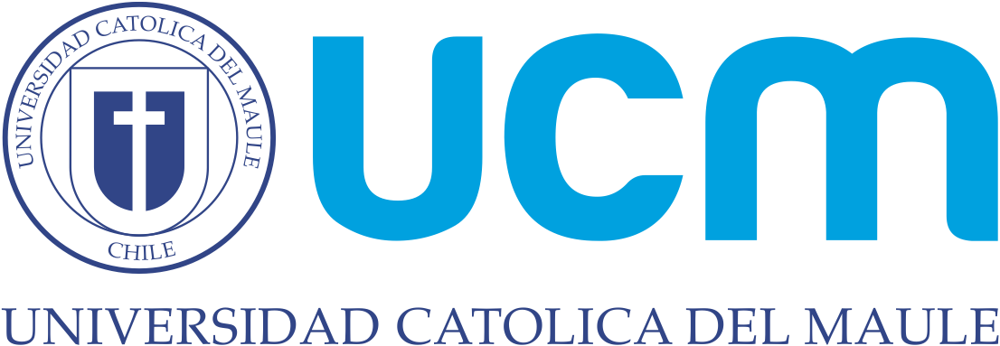

 

# Curso Computación Científica

Este repositorio recoge las clases, tutoriales y ejemplos del curso de los programas de [Doctorado en Ingeniería (DocIng)](http://www.docing.ucm.cl/index.html) y 
[Doctorado en Modelamiento Matemático Aplicado (DM2A)](http://vrip.ucm.cl/doctorado-en-modelamiento-matematico-aplicado/), de la Facultad de Ciencias Básicas y la Facultad de Ciencias de la Ingeniería, respectivamente,
en la [Universidad Católica del Maule](www.ucm.cl).
